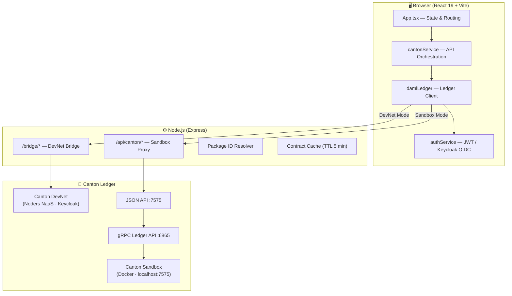
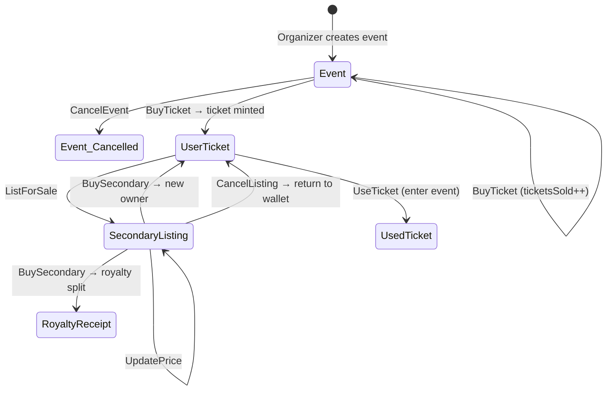
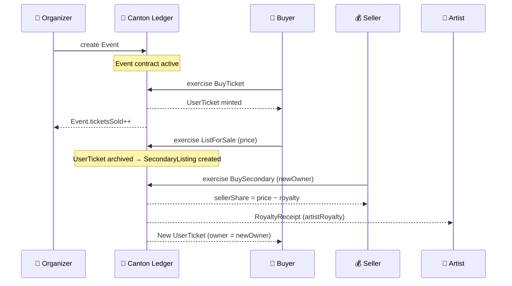

---

# 🎫 Canton Resonance

> **A high-performance event ticketing and royalty settlement platform built on the Canton Network.**

Canton Resonance manages event tickets, artist royalty payments, and organizer–buyer workflows using **Daml smart contracts**. It runs on Canton Sandbox (local development) or Canton DevNet (live network) in the background. The frontend is built with **React 19 + Vite**, and the backend with **Express + TypeScript**.

---

## 📋 Table of Contents

- [Project Overview](#-canton-resonance)
- [Features](#-features)
- [Requirements](#-requirements)
- [Installation](#-installation)
- [Configuration (.env)](#️-configuration-env)
- [Usage](#-usage)
- [Project Structure](#-project-structure)
- [API Reference](#-api-reference)
- [Running with Docker](#-running-with-docker)
- [Daml Smart Contracts](#-daml-smart-contracts)
- [Screenshots / Demo](#-screenshots--demo)
- [Contributing](#-contributing)
- [License](#-license)
- [Contact / Support](#-contact--support)
- [Roadmap](#-roadmap)
- [Changelog](#-changelog)
- [Acknowledgements](#-acknowledgements)

---

## ✨ Features

- **Daml Smart Contracts** — Secure, auditable business logic with `Ticket`, `Event`, and `SecondaryListing` templates
- **Canton Sandbox Support** — Local development with unsigned JWT; no external wallet required
- **Canton DevNet Support** — Live network integration with signed Bearer tokens
- **Bridge Layer** — Translates Ledger API v2 endpoints (`/v2/commands/submit-and-wait`, `/v2/state/active-contracts`) into the legacy JSON API format
- **Dynamic Package ID Resolution** — Automatically reads `packageId` from build output
- **Party Management** — Automatic party creation and Admin token generation in Sandbox
- **Secondary Market (2. El Piyasası)** — Users can list tickets for resale; buyers can purchase or make offers. Own listings show disabled Buy/Offer buttons for clear UX
- **Market Panel** — Dual-tab marketplace UI: Primary Market (organizer events) and Secondary Market (user resale listings)
- **React 19 UI** — Tailwind CSS v4 + Motion animations + Lucide icons
- **Gemini AI Integration** — AI-powered suggestions via `@google/genai` SDK
- **Ethers.js v6** — Included for optional on-chain connectivity
- **Docker + Docker Compose** — One-command sandbox environment setup

---

## 🏗 Architecture & Working Scheme

Canton Resonance follows a **three-tier architecture** connecting a React SPA frontend to the Canton distributed ledger through a Node.js bridge/proxy layer. The system supports two operational modes: **Sandbox** (local development) and **DevNet** (live Canton Network).

### System Topology



### Dual-Mode Operation

| Aspect | 🧪 Sandbox (Local) | 🌐 DevNet (Live) |
|---|---|---|
| **Ledger** | Docker container (`localhost:7575`) | Noders NaaS participant node |
| **Auth** | Unsigned JWT (auto-generated) | Keycloak OIDC (`access_token`) |
| **API Path** | `/api/canton/*` → Express proxy | `/bridge/*` → Ledger API v2 bridge |
| **Party** | Auto-allocated (`Setup.daml`) | Pre-registered via Keycloak |
| **Package ID** | Read from local codegen output | Discovered from `/v2/packages` |

### Smart Contract Lifecycle

The platform uses **4 core Daml templates** and **1 auxiliary template** that form a complete ticket lifecycle:



| Template | Signatory | Purpose |
|---|---|---|
| `Event` | Organizer | Primary event with ticket inventory and pricing |
| `UserTicket` | Organizer + Owner | A purchased ticket in a user's wallet |
| `SecondaryListing` | Seller + Organizer | Ticket listed for resale on the secondary market |
| `RoyaltyReceipt` | Organizer + Seller | Immutable record of royalty payment to artist |
| `UsedTicket` | Organizer + Owner | Record that a ticket was consumed (event entry) |

### Data Flow: Ticket Purchase → Resale → Royalty



### Frontend Component Tree

```
App.tsx (state + routing + polling)
├── WalletLogin           → Party authentication (Sandbox / DevNet)
├── OrganizerPanel        → Create events, manage inventory, cancel
├── UserPanel             → Wallet: tickets, list for sale, use ticket
│   ├── Sell Modal        → Set resale price, enforce max multiplier
│   └── Wallet Filters    → Exclude tickets already listed
├── MarketPanel           → Dual-tab marketplace
│   ├── Primary Tab       → Buy directly from organizer events
│   └── Secondary Tab     → Browse resale listings, buy or offer
│       └── Own listings  → Buttons visible but disabled
├── ArtistPanel           → Royalty dashboard, revenue tracking
└── LedgerFeed            → Real-time contract activity stream
```

### Key Architectural Decisions

1. **Sticky Contract Cache** — After a `create` or `exercise` command, the frontend injects a synthetic contract into the UI immediately. A polling loop then reconciles with the ledger until the real contract ID appears, ensuring zero-latency UX.

2. **Bridge Layer (DevNet)** — The Express server translates Ledger API v2 (`/v2/commands/submit-and-wait`) responses into the legacy JSON API format (`/v1/*`), so the frontend uses a single contract shape regardless of mode.

3. **Automatic Package ID Resolution** — In DevNet mode, the client fetches visible package IDs from `/v2/packages` and tries each candidate until the template is found. This handles DAR redeployments transparently.

4. **Atomic Royalty Settlement** — The `BuySecondary` choice computes the artist royalty split and creates a `RoyaltyReceipt` within the same Canton transaction, guaranteeing atomicity.

5. **Archived Contract Tracking** — `localStorage` persists archived contract IDs so that stale/zombie contracts never re-emerge after page refreshes or HMR reloads.

---

## 🛠 Requirements

| Dependency | Version |
|---|---|
| Node.js | ≥ 18.x (ESM support) |
| npm | ≥ 9.x |
| Daml SDK | 2.10.4 |
| Docker | ≥ 24.x (optional, only for Docker-based sandbox) |
| Docker Compose | ≥ 2.x |

> **Note:** For Daml SDK installation → [docs.daml.com](https://docs.daml.com/getting-started/installation.html)

---

## 📦 Installation

### 1. Clone the repository

```bash
git clone https://github.com/Kewe63/CantonResonance1.git
cd CantonResonance1
```

### 2. Install dependencies

```bash
npm install
```

### 3. Set up environment variables

```bash
cp .env.example .env
# Edit the .env file (see the Configuration section below)
```

### 4. Build the Daml code (if Daml SDK is installed)

```bash
daml build
daml codegen js .daml/dist/canton-ticket-0.1.0.dar -o src/daml.js
```

### 5. Start the development server

```bash
npm run dev
```

The application will be available at `http://localhost:3000`.

---

## ⚙️ Configuration (.env)

Copy `.env.example` to create your `.env` file:

```env
# Canton Resonance 2.0 - Environment Variables

# --- PRODUCTION / DEVNET SETTINGS ---
# Fill these in if you are connecting to Canton DevNet:
CANTON_JSON_API_URL="https://api.your-canton-node.com"
CANTON_JWT_TOKEN="your-signed-jwt-token"
CANTON_PARTY_ID="your-party-id"

# --- LOCAL DEVELOPMENT ---
# These values are not needed for local sandbox.
# The app defaults to http://localhost:7575
# and generates unsigned sandbox tokens automatically.

# Node server port (default: 3000)
PORT=3000
```

| Variable | Description | Required? |
|---|---|---|
| `CANTON_JSON_API_URL` | Canton JSON API endpoint | DevNet only |
| `CANTON_JWT_TOKEN` | Signed JWT token | DevNet only |
| `CANTON_PARTY_ID` | Canton party identifier | DevNet only |
| `PORT` | Express server port | No (default: 3000) |

> In local sandbox mode, the app works without filling in any variables.

---

## 🚀 Usage

### Basic usage — Local sandbox

```bash
# 1. Start the sandbox with Docker
docker-compose up -d

# 2. Start the application
npm run dev

# 3. Open in browser
open http://localhost:3000
```

### Available npm scripts

| Script | Description |
|---|---|
| `npm run dev` | Starts the Vite + Express development server |
| `npm run build` | Creates a production build (`dist/`) |
| `npm run preview` | Previews the production build |
| `npm run lint` | Runs TypeScript type checking (`tsc --noEmit`) |
| `npm run clean` | Removes the `dist/` folder |

### Application flow

1. User logs in via UI (selects or creates a party)
2. Organizer creates an `Event` contract → Daml `create` command
3. Buyer purchases a ticket → `Transfer` choice is executed
4. Royalty payment → Forwarded to the artist via the `RoyaltySettle` choice
5. Active contracts are listed via `/api/canton/query`

---

## 📁 Project Structure

```
CantonResonance1/
│
├── daml/                          # Daml smart contracts
│   ├── Ticket.daml                # Ticket template
│   ├── Event.daml                 # Event template
│   └── Setup.daml                 # Init script (daml start)
│
├── src/                           # React frontend
│   ├── daml.js/                   # Daml codegen output (JS bindings)
│   ├── components/                # React components
│   │   ├── MarketPanel.tsx        # Marketplace (primary + secondary tabs)
│   │   ├── UserPanel.tsx          # User wallet & ticket management
│   │   ├── OrganizerPanel.tsx     # Organizer event management
│   │   ├── ArtistPanel.tsx        # Artist royalty dashboard
│   │   └── Toast.tsx              # Notification toasts
│   ├── hooks/                     # Custom React hooks
│   ├── pages/                     # Page components
│   └── main.tsx                   # Application entry point
│
├── server.ts                      # Express server + Canton proxy/bridge
├── vite.config.ts                 # Vite configuration
├── tsconfig.json                  # TypeScript configuration
├── daml.yaml                      # Daml project definition (SDK 2.10.4)
├── canton-sandbox.conf            # Canton sandbox settings
├── docker-compose.yml             # Sandbox Docker service
├── Dockerfile                     # Application Docker image
├── Dockerfile.sandbox             # Sandbox Docker image
├── entrypoint.sh                  # Docker entrypoint script
├── metadata.json                  # Project metadata
├── .env.example                   # Environment variables template
├── .gitignore
├── index.html                     # HTML entry point
└── package.json
```

---

## 🔌 API Reference

All endpoints run on `http://localhost:3000`.

### Express REST API

| Method | Path | Description |
|---|---|---|
| `GET` | `/api/test` | Server health check |
| `GET` | `/api/package-id` | Reads `packageId` from Daml codegen |
| `GET` | `/api/canton/parties` | Lists all parties in Sandbox |
| `POST` | `/api/canton/allocate-party` | Creates a new party |
| `GET` | `/api/canton/health` | Canton JSON API connectivity test |
| `POST` | `/api/canton/query` | Queries active contracts |
| `POST` | `/api/canton/create` | Creates a new contract |
| `POST` | `/api/canton/exercise` | Executes a contract choice |
| `POST` | `/api/debug-log` | Client error logging (development) |

### Bridge API (DevNet)

`/bridge/:action` — Bridges Ledger API v2 to the legacy JSON API format.

| Method | Path | Description |
|---|---|---|
| `GET` | `/bridge/packages` | Lists installed package IDs |
| `POST` | `/bridge/upload-dar` | Uploads a DAR file to DevNet |
| `POST` | `/bridge/query` | Queries active contracts (v2 format) |
| `POST` | `/bridge/create` | Creates a contract with package ID fallback |
| `POST` | `/bridge/exercise` | Executes a choice |

#### Example: Create a Contract

```bash
curl -X POST http://localhost:3000/api/canton/create \
  -H "Content-Type: application/json" \
  -H "Authorization: Bearer <sandbox-token>" \
  -d '{
    "templateId": "<packageId>:Ticket:Event",
    "payload": {
      "organizer": "Alice::sandbox",
      "artist": "Bob::sandbox",
      "title": "Rock Concert",
      "date": "2026-06-15"
    }
  }'
```

#### Example: Query Contracts

```bash
curl -X POST http://localhost:3000/api/canton/query \
  -H "Content-Type: application/json" \
  -d '{
    "templateIds": ["<packageId>:Ticket:Event"]
  }'
```

### Canton JSON API Port Map

| Port | Protocol | Description |
|---|---|---|
| `3000` | HTTP | Express application server |
| `6865` | gRPC | Canton Ledger API |
| `7575` | HTTP | Canton JSON API |

---

## 🐳 Running with Docker

### Start the sandbox with Docker

```bash
docker-compose up -d
```

`docker-compose.yml` includes:
- **sandbox** service: Runs Daml 2.10.4 sandbox on Linux
- Ports `6865` (gRPC) and `7575` (JSON API) are exposed externally

### Follow sandbox logs

```bash
docker-compose logs -f sandbox
```

### Stop and clean up

```bash
docker-compose down
docker-compose down -v  # Also remove volumes
```

### Run only the application with Docker

```bash
docker build -t canton-resonance .
docker run -p 3000:3000 --env-file .env canton-resonance
```

---

## 📜 Daml Smart Contracts

### Project Definition (`daml.yaml`)

```yaml
sdk-version: 2.10.4
name: canton-ticket
source: daml
version: 0.1.0
dependencies:
  - daml-prim
  - daml-stdlib
  - daml-script
init-script: Setup:setup
codegen:
  js:
    output-directory: src/daml.js
```

### Daml Commands

```bash
# Build the project
daml build

# Start the sandbox (setup script runs automatically)
daml start

# Generate JS bindings
daml codegen js .daml/dist/canton-ticket-0.1.0.dar -o src/daml.js

# Daml REPL (interactive)
daml repl .daml/dist/canton-ticket-0.1.0.dar
```

### Sandbox Token (Unsigned)

In local development, the server automatically generates an unsigned JWT:

```
Header: { alg: "none", typ: "JWT" }
Payload: {
  "https://daml.com/ledger-api": {
    "ledgerId": "sandbox",
    "applicationId": "canton-ticket-app",
    "admin": true,
    "actAs": ["Alice::sandbox"],
    "readAs": ["Alice::sandbox"]
  }
}
```

### Releases

| Version | DAR Name | Date |
|---|---|---|
| 0.1.0 | canton-ticket-0.1.0 (LF 2.2) | April 2026 |

---

## 🖥 Screenshots / Demo

> Screenshots and a live demo will be added soon.
>
> For a local demo: `npm run dev` → `http://localhost:3000`

---

## 🤝 Contributing

We welcome all contributions! Please follow these steps:

1. Fork this repository
2. Create a feature branch:
   ```bash
   git checkout -b feat/feature-name
   ```
3. Commit your changes:
   ```bash
   git commit -m "feat: descriptive commit message"
   ```
4. Push the branch:
   ```bash
   git push origin feat/feature-name
   ```
5. Open a Pull Request

### Code Standards

- TypeScript strict mode is enabled (check with `tsc --noEmit`)
- Use ESM module format (`"type": "module"` is required)
- New API endpoints go in `server.ts`; Daml templates go in the `daml/` folder
- Commit messages must follow [Conventional Commits](https://www.conventionalcommits.org/) format

### Opening an Issue

For bugs or feature requests, use [GitHub Issues](https://github.com/Kewe63/CantonResonance1/issues). When opening an issue, please:
- Specify your environment (local sandbox or DevNet?)
- Include the error message
- Provide step-by-step reproduction instructions

---

## 🗺 Roadmap

- [ ] User authentication UI (DevNet JWT login flow)
- [x] Ticket transfer and secondary market support
- [x] Secondary market Buy / Offer buttons (visible but disabled for own listings)
- [ ] Automated royalty distribution flow
- [ ] Multi-party support on Canton DevNet
- [ ] Mobile-friendly responsive design
- [ ] End-to-end test infrastructure (Playwright)
- [ ] GitHub Actions CI/CD pipeline
- [ ] Live demo deployment (Vercel / Railway)

---

## 📝 Changelog

### v0.2.0 — April 28, 2026
- **Secondary Market (2. El Piyasası)** — Full resale listing, buy, and offer flow
- **MarketPanel** — Dual-tab marketplace with Primary and Secondary market views
- Buy / Offer buttons now visible (but disabled) on user's own secondary market listings
- Wallet view filters out tickets already listed on the secondary market
- Sell modal auto-closes on successful listing
- Consistent numeric formatting (`fmtUsd`, `fmtPct`) across all UI surfaces
- i18n keys added for all market-related strings

### v0.1.0 — April 2026
- Initial stable release
- Dual-mode support for Canton Sandbox + DevNet
- Bridge layer: Ledger API v2 → JSON API compatibility layer
- Dynamic package ID resolution (`/api/package-id`)
- Sandbox admin token generation
- One-command sandbox setup with Docker Compose
- DAR release: `canton-ticket-dar-0.1.0-lf22`

---

## 🙏 Acknowledgements

- [Digital Asset / Daml](https://daml.com) — Smart contract infrastructure
- [Canton Network](https://canton.io) — Distributed ledger protocol
- [Vite](https://vitejs.dev) — Fast development server
- [Tailwind CSS](https://tailwindcss.com) — Styling framework
- [Motion](https://motion.dev) — Animation library
- [Lucide React](https://lucide.dev) — Icon set
- [Ethers.js](https://docs.ethers.org) — Ethereum connectivity

---

## 📬 Contact / Support

- **GitHub:** [@Kewe63](https://github.com/Kewe63)
- **Issues:** [GitHub Issues](https://github.com/Kewe63/CantonResonance1/issues)
- **Canton Developer Community:** [discuss.daml.com](https://discuss.daml.com)

--- 

## 📄 License

This project does not currently specify a license. Please contact the repository owner before use.

---

- Built with ❤️ for the CANTON Hackathon.
